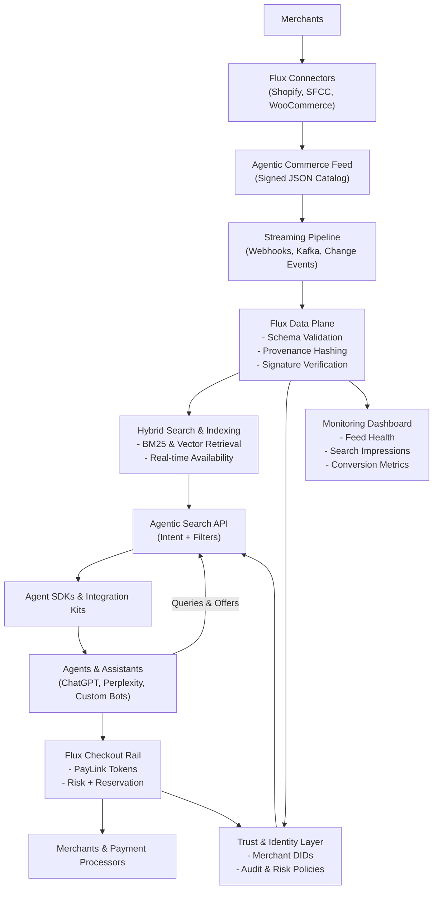

# Flux Discovery Architecture Overview

**Reading the Diagram**
- **Top:** merchants connect through Flux plug-ins or APIs to generate signed, structured Agentic Commerce Feeds.
- **Middle:** feeds stream into the Flux data plane where validation, provenance, and indexing power the hybrid search engine and trust services.
- **Bottom:** agents integrate via SDKs and the Agentic Search API, receive signed offers, and hand off to the checkout rail; dashboards keep merchants informed.
