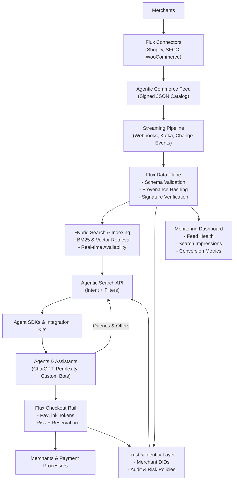

# Flux Discovery Architecture Overview

**Reading the Diagram**
- **Top:** merchants connect through Flux plug-ins or APIs to generate signed, structured Agentic Commerce Feeds.
- **Middle:** feeds stream into the Flux data plane where validation, provenance, and indexing power the hybrid search engine and trust services.
- **Bottom:** agents integrate via SDKs and the Agentic Search API, receive signed offers, and hand off to the checkout rail; dashboards keep merchants informed.

**Key Building Blocks**
- **Canonical Data Plane:** Standardize ingestion through the Agentic Commerce Feed (ACF). Ship Shopify/SFCC/BigCommerce/WooCommerce connectors that emit signed JSON with SKU metadata, availability, fulfillment options, and pricing so agents never scrape.
- **Streaming Freshness:** Support scheduled pushes and streaming (webhooks, Kafka, NATS) so inventory deltas arrive within seconds; publish change events with sequence IDs to keep consumer caches coherent.
- **Hybrid Search Layer:** Combine BM25 and vector retrieval inside the Agentic Search API. Maintain per-merchant and global indices with filters for price, size, geo radius, and fulfillment type.
- **Contextual Enrichment:** Add graph edges (brand, store, category) and LLM-generated descriptors while keeping merchant-signed fields authoritative.
- **Trust Envelope:** Attach DIDs, JWS signatures, and provenance hashes to every feed chunk and search result. Maintain revocation lists and policy hints so agents spot tampering.
- **Discovery API UX:** Offer a simple `POST /search` for natural-language intent plus filters; return ranked offers with provenance, availability, and checkout tokens. Provide `GET /catalog/{product_id}` for deep dives.
- **Agent Integration Kits:** Deliver SDKs (Python/JS/Go) and prompt templates so builders integrate Flux search, interpret results, and fall back gracefully when items are unavailable or user confirmation is required.
- **Merchant Dashboard:** Surface feed health, search impressions, conversion metrics, and validation alerts; promote adoption via Flux verification badges.
- **Privacy & Policy Guardrails:** Embed risk scoring, enforce validity windows, and include consent tokens to prove authorization. Log interactions in the Trust & Identity Layer for regulators and auditors.
