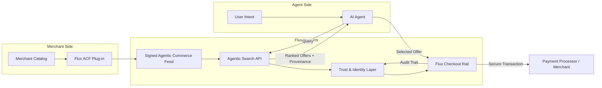

# Flux Experience Flow

**How to read it**
- **Merchant Side:** Flux plug-ins turn raw catalogs into signed Agentic Commerce Feeds.
- **Flux Platform:** Feeds flow into search, trust, and checkout layers, preserving provenance at every step.
- **Agent Side:** Agents convert user intent into structured queries and receive signed, verifiable offers before executing checkout.
- **Checkout:** Flux handles the secure transaction while recording audit trails for compliance and trust badges.

Use this diagram during pitches to quickly walk investors through the end-to-end loop without diving into implementation details.
